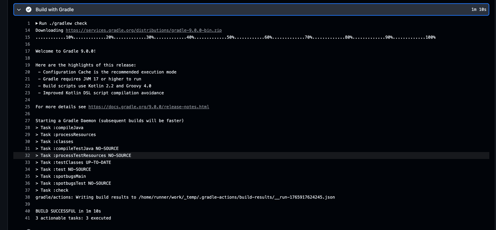
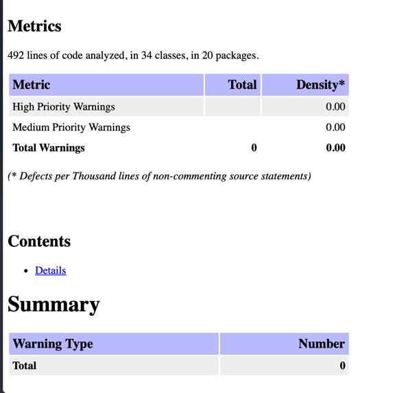
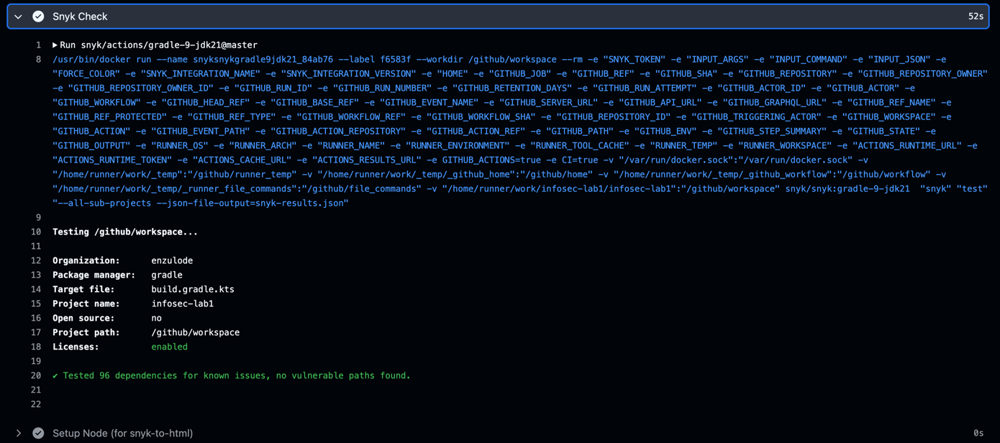
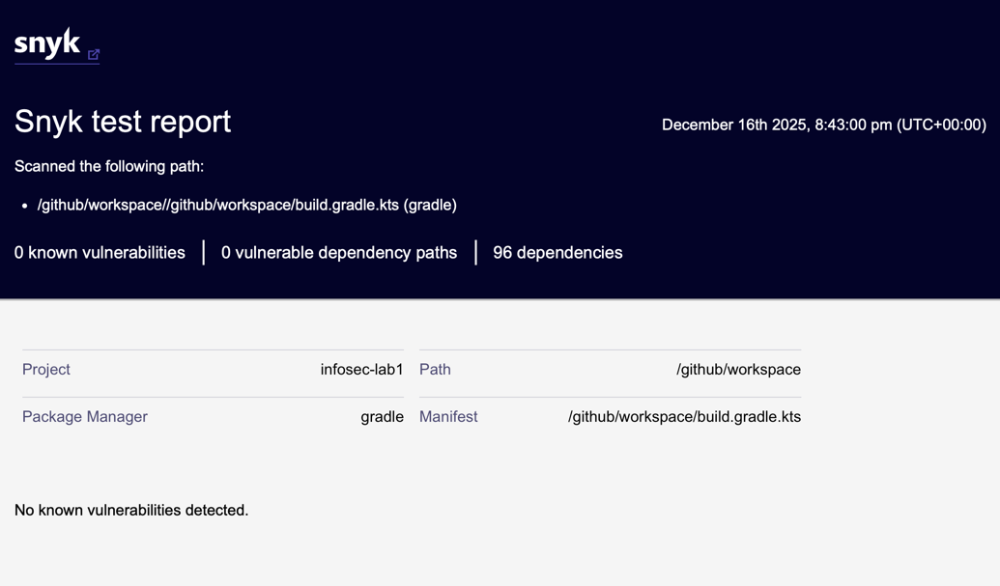

## Работа 1: Разработка защищенного REST API с интеграцией в CI/CD
`Описание`: проект представляет собой защищенное веб-приложение на основе Spring Boot (java 21). Реализован 
простой REST API, защищённый в соответствии с рекомендациями OWASP Top 10. В проект интегрированы инструменты
автоматизированной проверки безопасности в CI/CD-пайплайне.

### API

#### Публичные эндпоинты
`POST /api/register` Регистрация нового пользователя \
Запрос
```json
{
  "username": "<some-username>",
  "email": "<some-email>",
  "password": "<some-password>"
}
```
Ответ
```json
{
  "token": "<some-token>"
}
```

`POST /api/login` Аутентификация нового пользователя \
Запрос
```json
{
  "username": "someuname",
  "password": "some password"
}
```
Ответ
```json
{
  "token": "<some-token>"
}
```

`GET /api/total-count` - Получение кол-ва зарегестрированных пользователей \
Запрос - без тела \
Ответ
```json
{
  "&lt;script&gt;alert(&#39;wow xss :/&#39;)&lt;/script&gt; Total user count: 0'
}
```


#### Защищенные эндпоинты
`GET /api/data` - Получение списка зарагестированных пользователей \
Запрос - без тела (но с jwt токеном в Authorization заголовке) \
Ответ
```json
{
  [
    {
      "username": "<some-username>",
      "email": "<some-email>"
    },
    ...
  ]
}
```


`POST /api/send-data` - Отправка тестовых данных клиентом серверу \
Запрос
```json
{
  "<some testing data>"
}
```
Ответ
```json
"&lt;script&gt;alert(&#39;wow xss :/&#39;)&lt;/script&gt; added: <some sanitized output>"
```

### Меры защиты
1. Защита от SQL инъекции
    Решение: использование Spring Data Jpa с параметризованными запросами. Пример:
    ```java
    @NoRepositoryBean
    public interface IUserSDRepository extends JpaRepository<UserEntity, Long> {
      Optional<UserEntity> findByUsername(String username);
      Optional<UserEntity> findByEmail(String email);
      boolean existsByUsername(String username);
      boolean existsByEmail(String email);
    }
    ```
2. Защита от XSS
    Решение: экранирование HTML средствами фремфорка Spring. Пример:
    ```java
    @GetMapping("/total-count")
    public String data2() {
      var response = "<script>alert('wow xss :/')</script> Total user count: %d".formatted(userService.countAll());
      return HtmlUtils.htmlEscape(response);
    }
    ```
3. Безопасная аутентификация
   Решение: реализована аутентификация пользователей с использованием JWT. В качестве middleware выступает JwtAuthFilter \
   JWTs:
   - подписан секретным ключом (не попадает в интернет)
   - короткое время жизни
   - при валидации проверяется подпись и срок действия
   - пароли хешируются при помощи BCrypt

4. Защита от узявимостей в зависимостях (SCA)
   Решение: запуск проверки утилитой Snyk при каждом push/PR в master ветку

5. Статический анализ кода (SAST)
   Решение: запуск проверки утилитой SpotBugs при каждом push/PR в master ветку

### Результаты проверок
Успешный запуск SpotBugs: [spotbugs-logs](https://github.com/enzulode/infosec-lab1/actions/runs/20282029955/job/58246309174) \
Ссылка на скачивание отчета: [отчет spotbugs](https://github.com/enzulode/infosec-lab1/actions/runs/20282029955/artifacts/4890790135) \



Успешный запуск Snyk: [spotbugs-logs](https://github.com/enzulode/infosec-lab1/actions/runs/20282029955/job/58246469108) \
Ссылка на скачивание отчета: [отчет snyk](https://github.com/enzulode/infosec-lab1/actions/runs/20282029955/artifacts/4890806548) \


